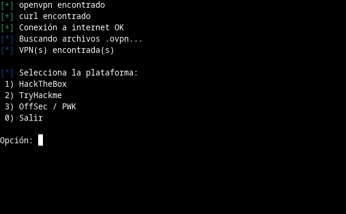
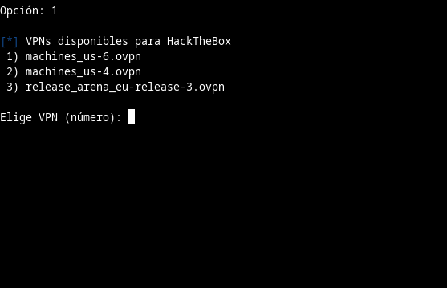
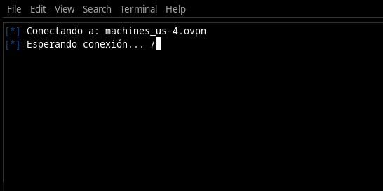
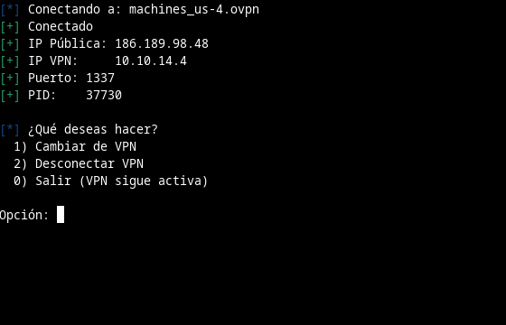
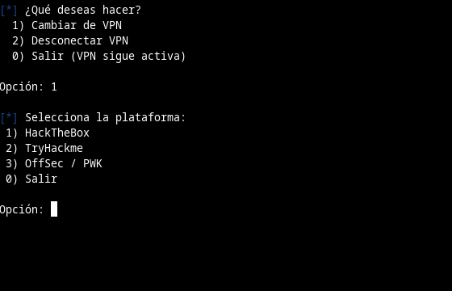
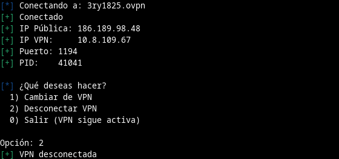

# labvpn

Si practicas CTF en plataformas como HackTheBox o TryHackMe, sabes lo tedioso que es buscar el archivo `.ovpn` correcto y ejecutar openvpn manualmente cada vez. **labvpn** resuelve esto: detecta tus archivos de conexión automáticamente, identifica la plataforma y te conecta en segundos desde un menú interactivo.

---

## Características

- Detecta automáticamente archivos `.ovpn` en tu sistema
- Identifica la plataforma (HackTheBox, TryHackMe, OffSec / PWK, etc.) por contenido o ruta
- Menú interactivo para seleccionar plataforma y VPN
- Muestra IP pública e IP de la VPN (`tun0`) al conectar
- Detecta si ya hay una VPN activa y ofrece desconectarla
- Manejo de interrupciones con `Ctrl+C` sin dejar procesos huérfanos
- Animación de espera mientras establece la conexión

---

## Requisitos

- `bash`
- `openvpn`
- `curl`

---

## Instalación

```bash
git clone https://github.com/anonimo-eng/labvpn.git
cd labvpn
chmod +x labvpn.sh
```

Opcionalmente, agrégalo a tu PATH para ejecutarlo desde cualquier lugar:

```bash
sudo cp labvpn.sh /usr/local/bin/labvpn
```

---

## Uso

```bash
./labvpn.sh
```

---

## Demo

**Menú inicial — verificación de requisitos y selección de plataforma**



**Selección de VPN disponible para la plataforma elegida**



**Conectando — animación de espera mientras establece la conexión**



**VPN conectada — muestra IP pública, IP de la VPN, puerto y PID**



**Menú post-conexión — cambiar de VPN, desconectar o salir**



**Desconectar VPN**



**Detección de VPN activa al iniciar**


---

## Plataformas soportadas

| Plataforma | Identificación |
|---|---|
| HackTheBox | Contenido del `.ovpn` o ruta con `hackthebox` / `htb` |
| TryHackMe | Contenido del `.ovpn` o ruta con `tryhackme` / `thm` |
| OffSec / PWK | Contenido del `.ovpn` o ruta con `offensive-security` / `oscp` |
| PentesterLab | Contenido del `.ovpn` |
| Hacking.Land | Contenido del `.ovpn` |
| VulnHub | Contenido del `.ovpn` |

---

## Notas

- El script busca archivos `.ovpn` en `/home`, `/root` y `/etc`
- Si tu archivo `.ovpn` no tiene identificadores de plataforma en su contenido, el script usa la ruta del archivo como fallback
- El `sudo` se solicita antes de conectar para evitar interrupciones durante el proceso

---

## Licencia

MIT
